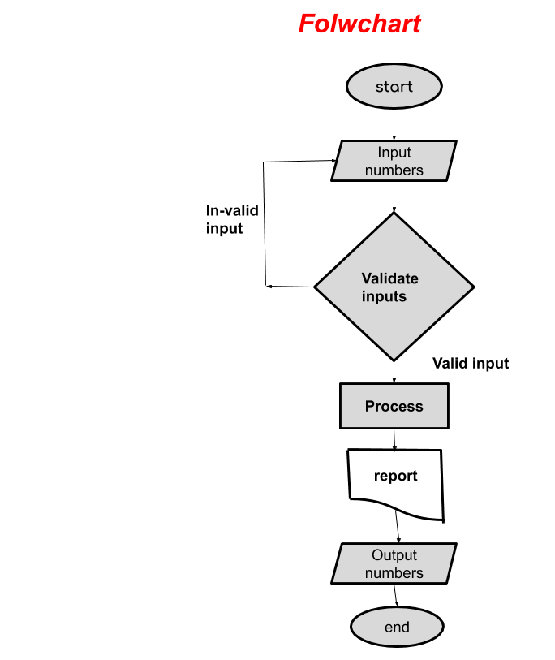
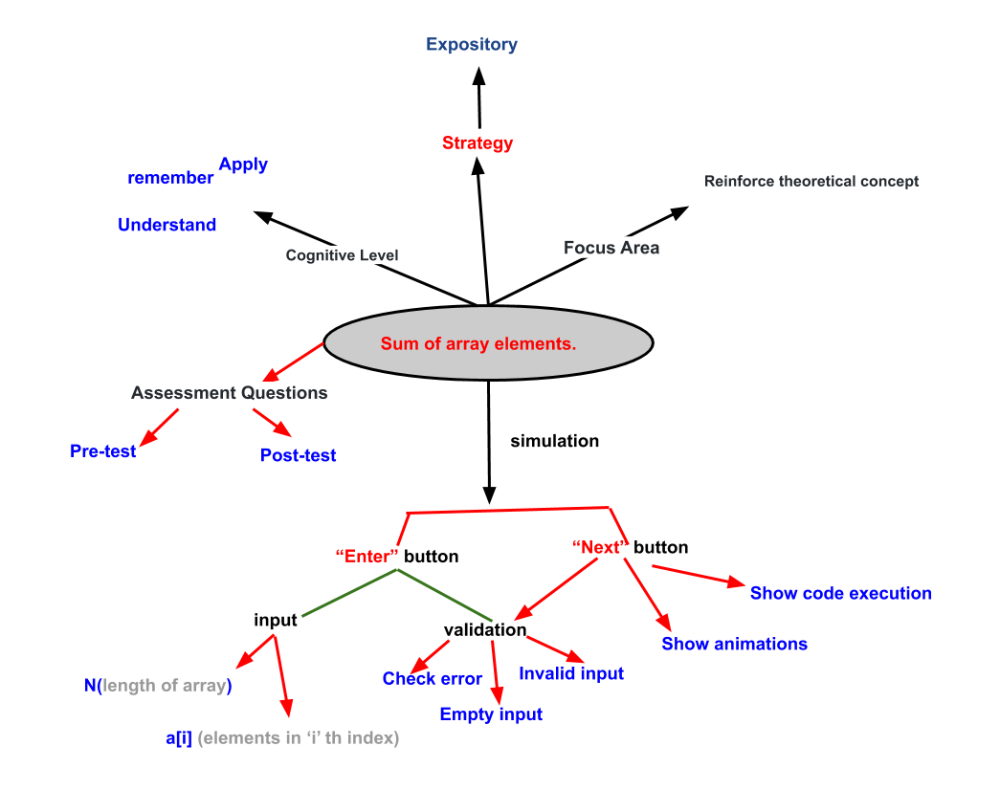

## Storyboard (Round 2)

Experiment 3:  Write a program that simply takes elements of array from the user and finds the sum of these elements.

### 1. Story Outline:

An array is a collection of similar types of data. It is a container that holds data (values) of one single type. we will detail in on all the ways to add elements and find the sum of all array elements in C programming.

### 2. Story:

This experiment is based on takes elements of array from user and sum of all those elements. The experiment will start by the input of size of array, student will have to give elements of array as a input. And the program will add those elements to array and after that user will find the sum of all those array elements at the execution of program. And this is how the program will give the sum of all array elements.

#### 2.1 Set the Visual Stage Description:

Simulator starts with the experiment name on the top and show the code in code block. Simulator consist of three blocks, at the left click on NEXT, the simulator asks for size of array. User will have to give size of array and then click on ENTER button after that simulator asks for array elements input from the user. User will have to give array elements and then click on <b>ENTER</b>. After that array elements will show in the memory block of the simulator. And then the user will have to press next until the program finishes. At the execution of the program user will get the sum of array elements and will show in the memory block of the simulator. 

#### 2.2 Set User Objectives & Goals:

1. The main objective of the user is to get sum of array elements.
2. To get to know about the algorithm of sum of array elements.
3. To understand how to assign the elements to array.
4. User need to answer some question based on the experiment. 

#### 2.3 Set the Pathway Activities:

1. User start the simulator.
2. User click on NEXT.
3. Code runs. 
4. User click on NEXT.
5. Simulator asks for size of array.
6. User inputs the value and click on <b>ENTETR</b>.
7. Simulator asks for the value of array elements.
8. User inputs the value of array elements and click on <b>SUBMIT</b>.
9. The value of num2 will assign to the value of num1.
10. Array elements will show in the memory block of simulator.
11. Click on NEXT.
12. Array Elements will be added till user click on NEXT.
13. User will get sum of array elements at the execution of the program.
14. Program finished.

##### 2.4 Set Challenges and Questions/Complexity/Variations in Questions:

Difficuty level: Evaluate 
Q1- Predict output of following program. 
             int main() 
                { 
             int i; 
             int arr[5] = {1}; 
             for (i = 0; i < 5; i++) 
             printf("%d ", arr[i]); 
             return 0; 
             } 

(a) 1 followed by four garbage values  
(b) 1 1 1 1 1  
<b>(c) 1 0 0 0 0 </b>  
(d) 0 0 0 0 0  

Difficuty level: Evaluate 
Q2- Does C perform array out of bound checking? What is the output of the following program?  
                              int main() 
                                { 
                               int i; 
                               int arr[5] = {0}; 
                               for (i = 0; i <= 5; i++) 
                               printf("%d ", arr[i]); 
                               return 0; 
                               }  
                                  
(a) Compiler Error: Array index out of bound.  
<b>(b) The program may print 0 five times followed by garbage value, or may crash if address (arr+5) is invalid.</b>  
(c) The program always crashes. 
(d) None of them 

Difficulty level: Apply 
Q3- What does the following declaration mean?  
        int (*ptr)[10];  

<b>(a)ptr is a pointer to an array of 10 integers</b> 
(b) ptr is an array of 10 integers 
(c) ptr is an pointer to array 
(d) ptr is array of pointers to 10 integers 

Difficulty level: Evaluate 
Q4- In C, if you pass an array as an argument to a function, what actually gets passed ? 
<b>(a) First element of the array</b> 
(b) Base address of the array 
(c) Value of elements in array 
(d) Address of the last element of array 

Difficulty level: Apply 
Q5-  Predict the output of below program. 
            #include <stdio.h>  
            int main() 
               {  
            int arr[5]; 
            // Assume that base address of arr is 2000 and size of integer  
            // is 32 bit   
            arr++;   
            printf("%u", arr);   
            return 0;  
            }   
(a) 2020 
<b>(b) lvalue required</b> 
(c) 2004 
(d) None of above 

##### 2.5 Allow pitfalls:

There are pitfalls in the simulator, mentioned below:
1. program will not perform if user will give more than 10 number in size of array.
2. User will get an "please provide inputs" message if user presses enter without giving input.
3. User will get an error message if user enter string(alphabets or symbols) input.
4. User should not enter less than size of array.

##### 2.6 Conclusion:

In this whole experiment, User will be able to learn deep concepts after implementing things by doing hands-on tasks. This contains tasks separately to each learning objective mentioned by us. Generally, it will take almost half an hour to perform the experiment and to grasp the concept fully. Based on the successful completion of the experiment, user will be able to uderstand the algorithm of sum of array. And simulator expalains easliy how this whole process is done and how the logic behind this process works. Hence with this, all the mentioned learning outcomes can be taken with the user.

##### 2.7 Equations/formulas: NA
int i, n; 
printf("Input the number of elements to be stored in the array :"); 
       scanf("%d",&n);  
printf("Input %d elements in the array :\n",n); 
      {  
      printf("element - %d : ",i);  
       scanf("%d",&a[i]);  
       }  
for(i=0; i<n; i++) 
   {  
      sum += a[i];  
   } 

### 3. Flowchart 4
 

 

### 4. Mindmap:

 
 
### 5. Storyboard :
Storyboard: <a href="Storyboard/carwiper.gif"> [here]</a>
